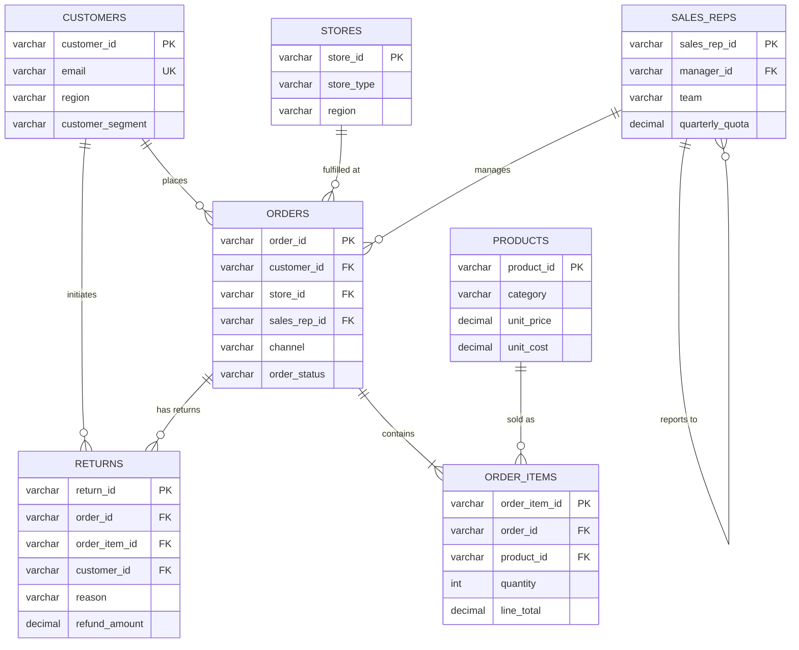

# Data Dictionary

## Sales Performance & Revenue Analytics Dashboard

| Field              | Detail                                         |
|--------------------|-------------------------------------------------|
| **Document Version** | 1.0                                            |
| **Date**             | 2026-07-17                                     |
| **Prepared By**      | Data Analytics Team                            |
| **Dataset Period**   | January 2023 – June 2025                       |
| **Status**           | Complete                                       |

---

## Table of Contents

1. [Dataset Overview](#1-dataset-overview)
2. [Table Descriptions & Column Details](#2-table-descriptions--column-details)
3. [Primary Keys & Foreign Keys](#3-primary-keys--foreign-keys)
4. [Entity Relationships](#4-entity-relationships)
5. [Data Quality Assessment](#5-data-quality-assessment)
6. [Missing Values Report](#6-missing-values-report)
7. [Duplicate Records Report](#7-duplicate-records-report)
8. [Recommendations](#8-recommendations)

---

## 1. Dataset Overview

The retail dataset consists of **7 tables** representing a multi-channel retail/e-commerce business spanning online, in-store, and marketplace sales channels.

| Table | Description | Rows | Columns | File |
|-------|-------------|------|---------|------|
| **customers** | Customer master data including demographics and segmentation | 5,020 | 11 | `data/raw/customers.csv` |
| **products** | Product catalog with pricing and cost information | 500 | 9 | `data/raw/products.csv` |
| **stores** | Physical store locations and attributes | 50 | 9 | `data/raw/stores.csv` |
| **sales_reps** | Sales team members with quotas and team assignments | 80 | 10 | `data/raw/sales_reps.csv` |
| **orders** | Transaction header records across all channels | 50,050 | 11 | `data/raw/orders.csv` |
| **order_items** | Line-level detail for each order (products, quantities, pricing) | 104,643 | 7 | `data/raw/order_items.csv` |
| **returns** | Product returns and refund records | 5,979 | 8 | `data/raw/returns.csv` |

**Total Records:** 166,322 | **Total Data Size:** ~50 MB | **Date Range:** 2023-01-01 to 2025-06-30

---

## 2. Table Descriptions & Column Details

### 2.1 Customers (`customers.csv`)

Stores customer demographic and segmentation data. Each row represents one registered customer.

| Column | Data Type | Nullable | Description | Example |
|--------|-----------|----------|-------------|---------|
| `customer_id` | VARCHAR(10) | No | Unique customer identifier (PK) | `CUST-00001` |
| `first_name` | VARCHAR(50) | No | Customer's first name | `James` |
| `last_name` | VARCHAR(50) | No | Customer's last name | `Smith` |
| `email` | VARCHAR(100) | Yes | Email address (business key) | `customer1@gmail.com` |
| `phone` | VARCHAR(20) | Yes | Contact phone number | `+1-555-123-4567` |
| `region` | VARCHAR(20) | No | Geographic region | `Northeast` |
| `state` | VARCHAR(2) | No | US state abbreviation | `NY` |
| `city` | VARCHAR(50) | No | City of residence | `New York` |
| `customer_segment` | VARCHAR(10) | No | Customer tier classification | `Premium` |
| `registration_date` | DATE | No | Date the customer account was created | `2023-05-15` |
| `is_active` | INTEGER (0/1) | No | Whether the customer account is active | `1` |

**Segment Values:** `Regular` (51.2%), `Premium` (24.5%), `New` (15.3%), `VIP` (9.0%)

**Region Values:** `Northeast` (24.7%), `West` (20.9%), `Southeast` (19.8%), `Midwest` (19.7%), `Southwest` (15.0%)

---

### 2.2 Products (`products.csv`)

Product master data containing the full catalog with pricing and cost information.

| Column | Data Type | Nullable | Description | Example |
|--------|-----------|----------|-------------|---------|
| `product_id` | VARCHAR(9) | No | Unique product identifier (PK) | `PROD-0001` |
| `product_name` | VARCHAR(100) | No | Descriptive product name | `TechPro Laptops A456` |
| `category` | VARCHAR(30) | No | Top-level product category | `Electronics` |
| `subcategory` | VARCHAR(30) | No | Sub-category within category | `Laptops` |
| `brand` | VARCHAR(30) | No | Product brand name | `TechPro` |
| `unit_price` | DECIMAL(10,2) | No | Retail selling price (USD) | `599.99` |
| `unit_cost` | DECIMAL(10,2) | Yes | Cost of goods sold per unit (USD) | `299.50` |
| `stock_quantity` | INTEGER | No | Current inventory level | `125` |
| `is_active` | INTEGER (0/1) | No | Whether the product is currently listed | `1` |

**Category Values:** `Home & Kitchen` (18.0%), `Clothing` (16.2%), `Books & Media` (15.2%), `Beauty & Health` (13.6%), `Toys & Games` (12.8%), `Sports & Outdoors` (12.8%), `Electronics` (11.4%)

**Price Range:** $6.00 – $1,964.14 | **Mean Price:** $301.65

---

### 2.3 Stores (`stores.csv`)

Physical retail location master data.

| Column | Data Type | Nullable | Description | Example |
|--------|-----------|----------|-------------|---------|
| `store_id` | VARCHAR(9) | No | Unique store identifier (PK) | `STORE-001` |
| `store_name` | VARCHAR(100) | No | Descriptive store name | `New York Flagship Store` |
| `store_type` | VARCHAR(20) | No | Store format classification | `Flagship` |
| `region` | VARCHAR(20) | No | Geographic region | `Northeast` |
| `state` | VARCHAR(2) | No | US state abbreviation | `NY` |
| `city` | VARCHAR(50) | No | City where store is located | `New York` |
| `opening_date` | DATE | No | Date the store opened | `2020-03-15` |
| `square_footage` | INTEGER | No | Store physical size in sq ft | `8500` |
| `is_active` | INTEGER (0/1) | No | Whether the store is currently operating | `1` |

**Store Type Values:** `Standard` (56.0%), `Outlet` (26.0%), `Flagship` (14.0%), `Pop-Up` (4.0%)

---

### 2.4 Sales Representatives (`sales_reps.csv`)

Sales team member profiles with performance quota assignments.

| Column | Data Type | Nullable | Description | Example |
|--------|-----------|----------|-------------|---------|
| `sales_rep_id` | VARCHAR(7) | No | Unique sales rep identifier (PK) | `REP-001` |
| `first_name` | VARCHAR(50) | No | Sales rep first name | `Michael` |
| `last_name` | VARCHAR(50) | No | Sales rep last name | `Johnson` |
| `email` | VARCHAR(50) | No | Corporate email address | `rep1@company.com` |
| `region` | VARCHAR(20) | No | Assigned sales territory region | `West` |
| `team` | VARCHAR(20) | No | Team assignment | `Team Alpha` |
| `hire_date` | DATE | No | Date hired into the organization | `2021-06-01` |
| `quarterly_quota` | DECIMAL(12,2) | No | Quarterly sales target (USD) | `175000.00` |
| `manager_id` | VARCHAR(7) | Yes | FK to sales_rep_id (self-reference, managers) | `REP-003` |
| `is_active` | INTEGER (0/1) | No | Whether the rep is currently employed | `1` |

**Team Values:** `Team Alpha`, `Team Beta`, `Team Gamma`, `Team Delta`

**Quota Range:** $51,867.80 – $298,723.53 | **Mean Quota:** $165,804.59

---

### 2.5 Orders (`orders.csv`)

Transaction header records capturing order-level details across all sales channels.

| Column | Data Type | Nullable | Description | Example |
|--------|-----------|----------|-------------|---------|
| `order_id` | VARCHAR(10) | No | Unique order identifier (PK) | `ORD-000001` |
| `customer_id` | VARCHAR(10) | Yes | FK to customers table | `CUST-00042` |
| `order_date` | DATE | No | Date the order was placed | `2024-03-15` |
| `channel` | VARCHAR(15) | No | Sales channel used | `Online` |
| `store_id` | VARCHAR(9) | Yes | FK to stores table (In-Store orders only) | `STORE-005` |
| `sales_rep_id` | VARCHAR(7) | Yes | FK to sales_reps table | `REP-012` |
| `marketplace` | VARCHAR(25) | Yes | Marketplace name (Marketplace orders only) | `Amazon` |
| `payment_method` | VARCHAR(15) | No | Method of payment used | `Credit Card` |
| `order_status` | VARCHAR(15) | No | Current order status | `Completed` |
| `shipping_cost` | DECIMAL(6,2) | No | Shipping charge applied (0 for In-Store) | `12.99` |
| `discount_amount` | DECIMAL(6,2) | No | Order-level discount applied | `15.50` |

**Channel Values:** `Online` (44.8%), `In-Store` (30.2%), `Marketplace` (25.0%)

**Status Values:** `Completed` (64.5%), `Shipped` (12.1%), `Processing` (8.1%), `Cancelled` (7.9%), `Returned` (7.3%)

**Payment Methods:** `PayPal` (19.2%), `Credit Card` (19.2%), `Apple Pay` (19.0%), `Debit Card` (18.8%), `Gift Card` (18.8%), `Cash` (5.0%)

**Marketplace Values:** `Amazon`, `eBay`, `Walmart Marketplace`

**Note:** `store_id` is NULL for Online/Marketplace orders; `marketplace` is NULL for Online/In-Store orders. This is by design.

---

### 2.6 Order Items (`order_items.csv`)

Line-item detail for each order, linking orders to specific products with quantity and pricing.

| Column | Data Type | Nullable | Description | Example |
|--------|-----------|----------|-------------|---------|
| `order_item_id` | VARCHAR(12) | No | Unique line item identifier (PK) | `ITEM-0000001` |
| `order_id` | VARCHAR(10) | No | FK to orders table | `ORD-000001` |
| `product_id` | VARCHAR(9) | No | FK to products table | `PROD-0042` |
| `quantity` | INTEGER | No | Number of units ordered | `2` |
| `unit_price` | DECIMAL(10,2) | Yes | Price per unit at time of sale (USD) | `149.99` |
| `line_discount` | DECIMAL(10,2) | No | Discount applied to this line item | `22.50` |
| `line_total` | DECIMAL(10,2) | No | Total for line: (unit_price × quantity) – line_discount | `277.48` |

**Avg Items per Order:** ~2.09 | **Quantity Distribution:** 1 (50%), 2 (25%), 3 (13%), 4 (7%), 5 (5%)

**Line Total Range:** $5.11 – $9,820.70 | **Mean Line Total:** $566.08

---

### 2.7 Returns (`returns.csv`)

Product return and refund tracking records.

| Column | Data Type | Nullable | Description | Example |
|--------|-----------|----------|-------------|---------|
| `return_id` | VARCHAR(10) | No | Unique return record identifier (PK) | `RET-000001` |
| `order_id` | VARCHAR(10) | No | FK to orders table (original order) | `ORD-003456` |
| `order_item_id` | VARCHAR(12) | No | FK to order_items table (specific item returned) | `ITEM-0007890` |
| `customer_id` | VARCHAR(10) | Yes | FK to customers table | `CUST-00042` |
| `return_date` | DATE | No | Date the return was initiated | `2024-04-01` |
| `reason` | VARCHAR(30) | No | Reason for return | `Defective Product` |
| `refund_amount` | DECIMAL(10,2) | No | Amount refunded to customer (USD) | `149.99` |
| `refund_status` | VARCHAR(10) | No | Current refund processing status | `Processed` |

**Return Reasons:** `Wrong Item Shipped` (12.7%), `Size/Fit Issue` (12.7%), `Damaged in Transit` (12.7%), `Arrived Late` (12.5%), `Better Price Found` (12.4%), `Changed Mind` (12.4%), `Defective Product` (12.3%), `Not As Described` (12.2%)

**Refund Status:** `Processed` (75.0%), `Pending` (15.0%), `Denied` (10.0%)

---

## 3. Primary Keys & Foreign Keys

### 3.1 Primary Keys

| Table | Primary Key | Type | Uniqueness |
|-------|------------|------|------------|
| customers | `customer_id` | Surrogate (CUST-XXXXX) | ✓ Unique (5,020 records) |
| products | `product_id` | Surrogate (PROD-XXXX) | ✓ Unique (500 records) |
| stores | `store_id` | Surrogate (STORE-XXX) | ✓ Unique (50 records) |
| sales_reps | `sales_rep_id` | Surrogate (REP-XXX) | ✓ Unique (80 records) |
| orders | `order_id` | Surrogate (ORD-XXXXXX) | ✗ **50 duplicates detected** |
| order_items | `order_item_id` | Surrogate (ITEM-XXXXXXX) | ✓ Unique (104,643 records) |
| returns | `return_id` | Surrogate (RET-XXXXXX) | ✓ Unique (5,979 records) |

### 3.2 Foreign Keys

| Child Table | FK Column | References | Parent Table | Nullable | Integrity Status |
|-------------|-----------|------------|--------------|----------|-----------------|
| orders | `customer_id` | `customer_id` | customers | Yes | ✗ 250 orphan records |
| orders | `store_id` | `store_id` | stores | Yes* | ✓ Valid |
| orders | `sales_rep_id` | `sales_rep_id` | sales_reps | Yes | ✓ Valid |
| order_items | `order_id` | `order_id` | orders | No | ✓ Valid |
| order_items | `product_id` | `product_id` | products | No | ✓ Valid |
| returns | `order_id` | `order_id` | orders | No | ✓ Valid |
| returns | `order_item_id` | `order_item_id` | order_items | No | ✓ Valid |
| returns | `customer_id` | `customer_id` | customers | Yes | ✓ Valid |
| sales_reps | `manager_id` | `sales_rep_id` | sales_reps | Yes | ✓ Self-referencing |

*\* `store_id` is conditionally NULL — only populated for In-Store channel orders.*

### 3.3 Business Keys

| Table | Business Key | Purpose | Uniqueness Issue |
|-------|-------------|---------|-----------------|
| customers | `email` | Natural identifier for customers | 20 duplicate emails detected (re-registrations) |
| sales_reps | `email` | Corporate identifier | ✓ Unique |
| products | `product_name` | Display identifier | ✓ Unique |

---

## 4. Entity Relationships

### 4.1 Entity Relationship Diagram

### 4.2 Relationship Summary

| Relationship | Type | Description |
|-------------|------|-------------|
| Customers → Orders | One-to-Many | A customer can place many orders |
| Orders → Order Items | One-to-Many | An order contains one or more line items |
| Products → Order Items | One-to-Many | A product appears in many order lines |
| Stores → Orders | One-to-Many | A store fulfills many in-store orders |
| Sales Reps → Orders | One-to-Many | A sales rep is assigned to many orders |
| Orders → Returns | One-to-Many | An order can have multiple return records |
| Sales Reps → Sales Reps | Self-referencing | Manager hierarchy (manager_id → sales_rep_id) |

---

## 5. Data Quality Assessment

### 5.1 Overall Quality Score

| Dimension | Score | Assessment |
|-----------|-------|------------|
| **Completeness** | 87/100 | Several columns have intentional NULLs; true data gaps are minimal |
| **Uniqueness** | 92/100 | 50 duplicate orders and 20 duplicate customer emails detected |
| **Referential Integrity** | 95/100 | 250 orphan customer references in orders table |
| **Validity** | 98/100 | All values fall within expected ranges and domains |
| **Consistency** | 96/100 | Conditional NULLs (store_id, marketplace) are logically consistent |
| **Timeliness** | 100/100 | Data covers full target period (Jan 2023 – Jun 2025) |

**Overall Data Quality Score: 94.7/100**

### 5.2 Quality Issues Summary

| # | Issue | Table | Severity | Records Affected | Recommended Action |
|---|-------|-------|----------|-----------------|-------------------|
| 1 | Duplicate order records (exact copies) | orders | **HIGH** | 50 rows | Deduplicate on `order_id`; investigate ETL double-load |
| 2 | Orphan customer references | orders | **MEDIUM** | 250 rows | Verify customer_id values exist; NULL or flag orphans |
| 3 | Duplicate customer emails | customers | **MEDIUM** | 40 rows (20 emails) | Merge duplicate accounts or flag re-registrations |
| 4 | Missing unit_cost | products | **LOW** | 10 rows (2%) | Source COGS from ERP; impute with category average |
| 5 | Missing unit_price in order_items | order_items | **LOW** | 313 rows (0.3%) | Back-fill from products table at time of sale |
| 6 | Missing customer_id in orders | orders | **LOW** | 250 rows (0.5%) | May represent guest checkouts; label accordingly |
| 7 | Missing phone in customers | customers | **LOW** | 152 rows (3%) | Optional field; no action required |

---

## 6. Missing Values Report

### 6.1 Summary by Table

| Table | Total Cells | Missing Cells | Missing % | Columns with NULLs |
|-------|-------------|---------------|-----------|---------------------|
| customers | 55,220 | 202 | 0.37% | email (50), phone (152) |
| products | 4,500 | 10 | 0.22% | unit_cost (10) |
| stores | 450 | 0 | 0.00% | — |
| sales_reps | 800 | 10 | 1.25% | manager_id (10) |
| orders | 550,550 | 73,214 | 13.30% | customer_id (250), store_id (34,939), sales_rep_id (500), marketplace (37,525) |
| order_items | 732,501 | 313 | 0.04% | unit_price (313) |
| returns | 47,832 | 39 | 0.08% | customer_id (39) |

### 6.2 Detailed Missing Values Analysis

| Table | Column | Missing Count | Missing % | Type | Root Cause |
|-------|--------|---------------|-----------|------|------------|
| customers | `email` | 50 | 1.00% | Data Gap | Incomplete registration data |
| customers | `phone` | 152 | 3.03% | Data Gap | Optional field, not always collected |
| products | `unit_cost` | 10 | 2.00% | Data Gap | COGS not available from supplier |
| sales_reps | `manager_id` | 10 | 12.50% | By Design | Top-level managers have no manager |
| orders | `customer_id` | 250 | 0.50% | Data Gap | Guest checkout / unmapped customers |
| orders | `store_id` | 34,939 | 69.81% | By Design | Only populated for In-Store channel |
| orders | `sales_rep_id` | 500 | 1.00% | Data Gap | Unassigned orders |
| orders | `marketplace` | 37,525 | 74.98% | By Design | Only populated for Marketplace channel |
| order_items | `unit_price` | 313 | 0.30% | Data Gap | Price lookup failure at time of sale |
| returns | `customer_id` | 39 | 0.65% | Data Gap | Inherited from guest checkout orders |

### 6.3 Classification

- **By Design (Expected NULLs):** `store_id`, `marketplace`, `manager_id` — These are conditionally populated based on business logic
- **Data Gaps (Actionable):** `email`, `phone`, `unit_cost`, `customer_id`, `sales_rep_id`, `unit_price` — These represent genuine data quality issues requiring remediation

---

## 7. Duplicate Records Report

### 7.1 Exact Row Duplicates

| Table | Total Rows | Duplicate Rows | Duplicate % | Status |
|-------|-----------|----------------|-------------|--------|
| customers | 5,020 | 0 | 0.00% | ✓ Clean |
| products | 500 | 0 | 0.00% | ✓ Clean |
| stores | 50 | 0 | 0.00% | ✓ Clean |
| sales_reps | 80 | 0 | 0.00% | ✓ Clean |
| **orders** | **50,050** | **50** | **0.10%** | **✗ Duplicates Found** |
| order_items | 104,643 | 0 | 0.00% | ✓ Clean |
| returns | 5,979 | 0 | 0.00% | ✓ Clean |

### 7.2 Primary Key Violations

| Table | PK Column | Total Records | Unique Values | Duplicated Keys | Status |
|-------|-----------|---------------|---------------|-----------------|--------|
| customers | `customer_id` | 5,020 | 5,020 | 0 | ✓ PASS |
| products | `product_id` | 500 | 500 | 0 | ✓ PASS |
| stores | `store_id` | 50 | 50 | 0 | ✓ PASS |
| sales_reps | `sales_rep_id` | 80 | 80 | 0 | ✓ PASS |
| **orders** | **`order_id`** | **50,050** | **50,000** | **50** | **✗ FAIL** |
| order_items | `order_item_id` | 104,643 | 104,643 | 0 | ✓ PASS |
| returns | `return_id` | 5,979 | 5,979 | 0 | ✓ PASS |

### 7.3 Business Key Duplicates

| Table | Business Key | Duplicated Values | Affected Records | Likely Cause |
|-------|-------------|-------------------|------------------|--------------|
| customers | `email` | 20 unique emails | 40 records | Customer re-registration with new ID |

### 7.4 Deduplication Recommendations

| Issue | Impact | Recommended Strategy |
|-------|--------|---------------------|
| 50 duplicate orders | Revenue over-counting, inflated KPIs | `DROP DUPLICATES` on `order_id`, keeping first occurrence |
| 20 duplicate customer emails | Double-counting in cohort analysis | Merge records using earliest `registration_date` as master |

---

## 8. Recommendations

### 8.1 Immediate Actions (Pre-Dashboard Development)

1. **Deduplicate orders table** — Remove 50 exact duplicate rows to ensure accurate revenue calculations
2. **Resolve orphan customer references** — Map 250 orders with invalid `customer_id` to existing customers or flag as guest checkouts
3. **Backfill missing `unit_price`** — Use product master price for 313 order items with NULL pricing
4. **Merge duplicate customer accounts** — Consolidate 20 duplicate email addresses into single customer records

### 8.2 Data Pipeline Improvements

5. **Add uniqueness constraints** — Enforce `order_id` uniqueness at the ETL layer to prevent future duplicate loads
6. **Implement NULL validation rules** — Alert on unexpected NULLs in `customer_id`, `sales_rep_id`, and `unit_price`
7. **Source COGS data** — Obtain missing `unit_cost` values from ERP system for accurate margin analysis

### 8.3 Governance & Documentation

8. **Establish data contracts** — Define expected NULL patterns (conditional columns) vs. unexpected NULLs
9. **Create automated quality checks** — Run completeness, uniqueness, and referential integrity checks on each ETL load
10. **Version control schema changes** — Track any modifications to table structures or business key definitions

---

*Document generated from automated data profiling. Source: `python/data_quality_assessment.py`*
